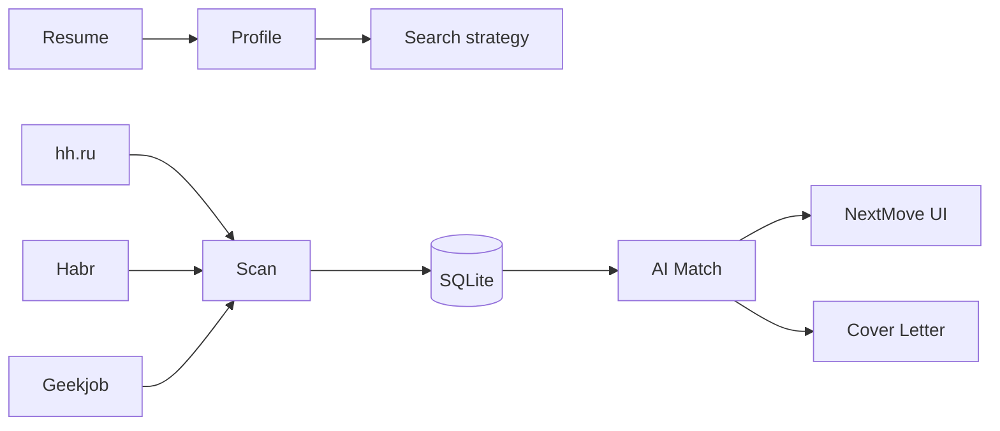

[Русский 🇷🇺](README_ru.md) / **English 🇺🇸**

# NextMove

**AI Career Copilot** — built to help you **get hired**, not just browse vacancies.

[](https://www.python.org/downloads/)
[](https://streamlit.io/)
[](LICENSE)

> Personal pet project for job search (Product Manager). Repo name: `job-scout`. UI brand: **NextMove**. Not SaaS, not auto-apply — analysis, prioritization, and application materials.

---

## Hello!

I built this for my own job search and shared it for friends and colleagues. Tired of manually checking hh.ru, Habr, and Geekjob? Fork it, open an [Issue](https://github.com/addito-5G/job-scout/issues), or message me on [Telegram](https://t.me/addito).

**Core product question:** *what should I do today to maximize my chances of getting an offer?*

---

## Screenshots

### Today — daily briefing

Open the app in the morning: new opportunities, best match, primary CTA, and quick navigation.


### Vacancy — AI Match & cover letter

Per-vacancy view: fit analysis (matched / missing skills), AI recommendation, and cover letter generation from a structured template.


### Market — Market Insights

Insights over vanity charts: demand, salary, match distribution, and trending skills to adjust your search strategy.


---

## Why it exists

| Pain | How NextMove helps |
|------|---------------------|
| Three platforms, three tabs | Auto-scan hh.ru, Habr Career, Geekjob |
| Hundreds of jobs — where to focus | AI Match % + matched / missing skills |
| Role switch (analyst → PM) | Profile filter without wiping the DB |
| Applying takes time | Cover letter draft per vacancy |
| No sense of progress | Application funnel + daily briefing |

---

## Features

| Section | Purpose |
|---------|---------|
| **Today** | Daily briefing: top action, insights, metrics |
| **Opportunities** | Prioritized list with match score and quick actions |
| **Saved / Applications** | Job search CRM funnel |
| **Resume** | AI Resume Coach — what to strengthen for the market |
| **Market** | Market Insights — demand, salary, skills |
| **Career Agent** | Search preferences (role, keywords, salary) |

Under the hood: scan → enrich → fast/deep match → cover letter. Schedule: daily at 09:00 (macOS launchd).

---

## How it works



### AI Router

| Task | Primary | Fallback |
|--------|---------|----------|
| `parse_resume`, `fast_match` | **Ollama** | Yandex → Groq |
| `cover_letter`, `suggest_filters` | **YandexGPT** | Groq → Ollama |
| `match_vacancy_deep`, `improve_resume` | **Groq** | Yandex → Ollama |

---

## Quick start

```bash
git clone https://github.com/addito-5G/job-scout.git
cd job-scout

python3 -m venv venv
source venv/bin/activate
pip install -r requirements.txt

cp .env.example .env
# GROQ_API_KEY, YC_FOLDER_ID, yandex_key.json, CONTACT_* for letters

python scripts/init_db.py
streamlit run app.py --server.port 8502
```

Open **http://localhost:8502** → upload resume (`.md`) → **Scan market** in the sidebar.

Or double-click **`Запустить Job Scout.command`**

### Schedule & enrich (optional)

```bash
pip install -r requirements-browser.txt
bash scripts/install_schedule.sh
```

---

## Environment variables

| Variable | Purpose |
|----------|---------|
| `OLLAMA_MODEL` | Local model |
| `GROQ_API_KEY` | Deep match |
| `YC_FOLDER_ID`, `YC_KEY_PATH` | YandexGPT |
| `CONTACT_PHONE`, `CONTACT_TELEGRAM`, `CONTACT_LINKEDIN` | Cover letter signature |
| `DATABASE_URL` | SQLite |

Full list: [`.env.example`](.env.example).

---

## Structure

```
job-scout/          # repository (legacy name)
├── app.py          # NextMove UI entry
├── ui/             # today, opportunities, applications, insights…
├── src/services/   # scan, match, today_service, cover_letter…
├── config/         # criteria, schedule, sources
└── scripts/        # CLI and launchd
```

---

## CLI

```bash
python scripts/setup.py
python scripts/scan.py
python scripts/match.py --limit 50
python scripts/daily_update.py --skip-scan   # without parsing
```

---

## Disclaimer

Personal pet project. Respect platform ToS; do not use for aggressive scraping.

---

## Author

- GitHub: [@addito-5G](https://github.com/addito-5G)
- Telegram: [@addito](https://t.me/addito)
- Email: [addito1@yandex.ru](mailto:addito1@yandex.ru)

---

## License

[MIT](LICENSE)
