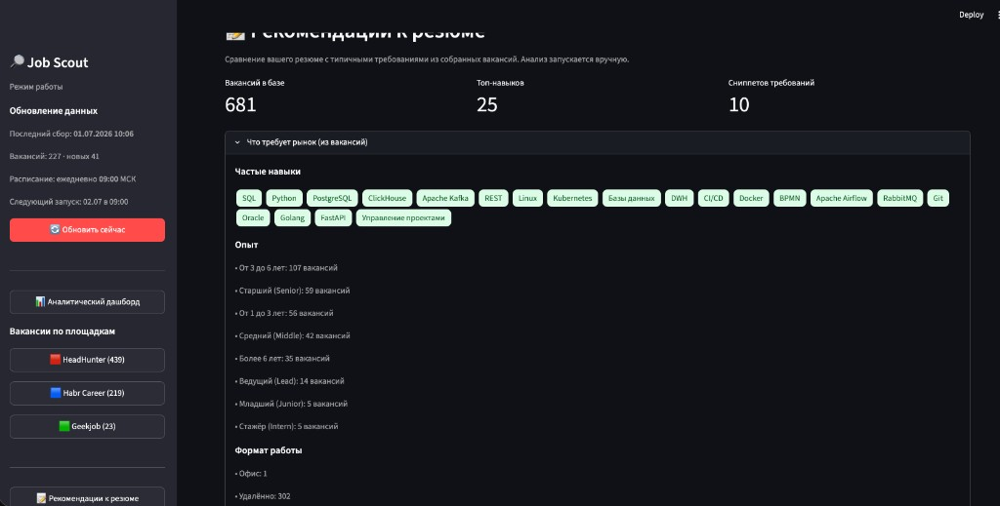
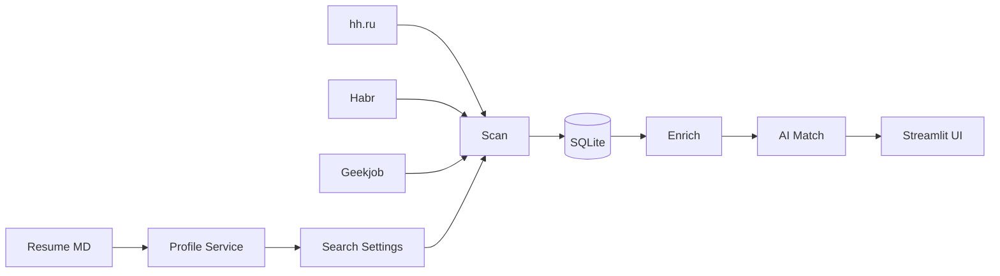

# Job Scout

**Personal job search assistant** — pet project for aggregating vacancies, AI-matching against your resume, and market analytics.

[](https://www.python.org/downloads/)
[](https://streamlit.io/)
[](LICENSE)

> Built for my own job hunt (Product Manager). Not a SaaS — no auto-apply, only analysis, recommendations, and cover letter drafts.



---

## Why this project

Switching roles (e.g. Product Analyst → Product Manager) means different market signals: skills, seniority, keywords. Job Scout:

- **Scrapes** hh.ru, Habr Career, and Geekjob into one SQLite database
- **Parses your resume** (Markdown) into a candidate profile and search settings
- **Scores & matches** vacancies with rule-based scoring + local/cloud LLMs
- **Filters by profile role** — analyst and PM vacancies coexist without wiping the DB
- **Shows market requirements** — top skills, experience, work format from real listings
- **Runs on a schedule** — daily auto-update via launchd (macOS)

---

## Features

| Module | What it does |
|--------|----------------|
| **Scan** | Multi-source parsing driven by AI-generated search settings |
| **Enrich** | Full descriptions, skills, salary via headless browser (optional) |
| **Match** | Fast match (Ollama) + deep match (Groq/Yandex) vs. your profile |
| **Dashboard** | Plotly charts: sources, skills, salary, match distribution |
| **Resume advice** | Compare resume to market requirements; AI improvement tips |
| **Cover letter** | Draft tailored to a specific vacancy |

---

## Architecture



### AI Router

Tasks are routed across providers with fallback chains and DB cache:

| Task | Primary | Fallback |
|------|---------|----------|
| `parse_resume`, `fast_match` | **Ollama** (local) | Yandex → Groq |
| `suggest_filters`, `cover_letter` | **YandexGPT** | Groq → Ollama |
| `match_vacancy_deep`, `improve_resume` | **Groq** | Yandex → Ollama |

---

## Quick start

```bash
git clone https://github.com/addito-5G/job-scout.git
cd job-scout

python3 -m venv venv
source venv/bin/activate
pip install -r requirements.txt

cp .env.example .env
# Fill in GROQ_API_KEY, YC_FOLDER_ID; add yandex_key.json if using YandexGPT

cp browser_config.example.json browser_config.json  # optional, for enrich

python scripts/init_db.py
streamlit run app.py
```

Open **http://localhost:8501**, upload your resume (`.md`), configure search, hit **«Обновить сейчас»**.

### Optional: browser enrich + schedule

```bash
pip install -r requirements-browser.txt
python -m camoufox fetch
bash scripts/install_schedule.sh   # daily 09:00, macOS launchd
```

---

## Environment

| Variable | Purpose |
|----------|---------|
| `OLLAMA_MODEL` | Local model (`qwen2.5:14b`) |
| `GROQ_API_KEY` | Deep match & resume advice |
| `YC_FOLDER_ID`, `YC_KEY_PATH` | YandexGPT |
| `RESUME_PATH` | Default resume path |
| `DATABASE_URL` | `sqlite:///./data/vacancies.db` |

See [`.env.example`](.env.example) for the full list.

---

## Project structure

```
job-scout/
├── app.py                 # Streamlit entry
├── ui/                    # pages & components
├── config/
│   ├── criteria.yaml      # scoring rules (customize)
│   ├── schedule.yaml      # auto-update schedule
│   └── sources.yaml       # parsers & browser
├── scripts/               # CLI: scan, enrich, match, daily_update
├── src/
│   ├── adapters/          # hh, habr, geekjob
│   ├── ai/                # router, providers, prompts, cache
│   ├── db/                # SQLAlchemy models
│   └── services/          # profile, scan, match, dashboard
└── data/                  # local DB & logs (gitignored)
```

---

## CLI

```bash
python scripts/setup.py              # resume → profile + search settings
python scripts/scan.py               # scrape vacancies
python scripts/enrich.py --limit 20  # browser enrich
python scripts/match.py --limit 30   # AI fast match
python scripts/daily_update.py       # full scheduled pipeline
```

---

## Disclaimer

Personal pet project for learning and own job search. Respect job board ToS; do not use for aggressive or commercial scraping.

---

## Author

**Andrey Nakimov** — Product Manager  
GitHub: [@addito-5G](https://github.com/addito-5G)

---

## License

[MIT](LICENSE)
