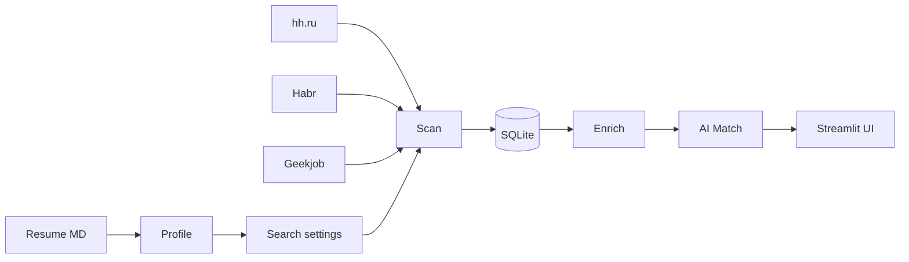

[Русский 🇷🇺](README_ru.md) / **English 🇺🇸**

# Job Scout

**Personal job search assistant** — a pet project for collecting vacancies, AI matching against your resume, and market analytics.

[](https://www.python.org/downloads/)
[](https://streamlit.io/)
[](LICENSE)

> Built for my own job search (Product Manager). This is not SaaS and not auto-apply — only analysis, recommendations, and cover letter drafts.


---

## Hello!

This repository is my personal tool for job hunting: I built it for myself and shared it here for friends and colleagues.

If you're also tired of manually monitoring hh.ru, Habr, and Geekjob — take a look, fork it, and reach out via [Issues](https://github.com/addito-5G/job-scout/issues) or [Telegram](https://t.me/addito). I'd love your feedback and to connect with new people.

---

## Why this exists

During an active job search, I got tired of the same manual loop:

- **Three platforms — three tabs.** hh.ru, Habr Career, Geekjob. Every morning the same routine: log in, run through filters, note what's new, and don't forget what you already looked at yesterday.
- **Role change — different market.** Moving from product analytics to product management isn't just a different resume. Different keywords, different skills in requirements, a different seniority slice. Old saved analyst vacancies cluttered the picture for PM roles.
- **Hard to know where to focus.** You have a resume, hundreds of vacancies — but what does the market actually require right now? SQL and ClickHouse or unit economics and growth? Without aggregation, it's guesswork.
- **Applying takes time.** For every interesting vacancy — read the description again, compare with your experience, draft a cover letter. Dozens of positions per week is exhausting.

Job Scout addresses this pain: **set up your profile once — then the system collects, filters, scores, and shows what the market demands**. I stay at the decision stage: apply or not.

---

## What it does

| Module | Purpose |
|--------|---------|
| **Scan** | Parse hh.ru, Habr Career, and Geekjob using AI-driven settings from your resume |
| **Enrich** | Full description, skills, and salary from the vacancy page (browser, optional) |
| **Match** | Fast match (Ollama) and deep match (Groq/Yandex) — how well a vacancy fits your profile |
| **Role filter** | Analyst and PM vacancies in one database — sidebar toggle, no DB wipe |
| **Dashboard** | Metrics, top skills, work format, vacancy posting trends |
| **Resume recommendations** | Compare your resume with market requirements; what to strengthen, what's missing |
| **Cover letter** | Draft cover letter tailored to a specific vacancy |
| **Schedule** | Daily auto-collection at 09:00 (macOS launchd) — fresh data in the morning |

Auto-apply is **intentionally not implemented**: the tool helps narrow the funnel and prepare materials, not spray applications blindly.

---

## How it works



### AI Router

Tasks are routed across providers with a fallback chain and DB cache:

| Task | Primary | Fallback |
|--------|---------|----------|
| `parse_resume`, `fast_match` | **Ollama** (local) | Yandex → Groq |
| `suggest_filters`, `cover_letter` | **YandexGPT** | Groq → Ollama |
| `match_vacancy_deep`, `improve_resume` | **Groq** | Yandex → Ollama |

---

## Quick start

```bash
git clone https://github.com/addito-5G/job-scout.git
cd job-scout

python3 -m venv venv
source venv/bin/activate
pip install -r requirements.txt

cp .env.example .env
# Fill in GROQ_API_KEY, YC_FOLDER_ID; place yandex_key.json for YandexGPT

cp browser_config.example.json browser_config.json  # optional, for enrich

python scripts/init_db.py
streamlit run app.py
```

Open **http://localhost:8501** → upload your resume (`.md`) → configure search → **"Update now"** in the sidebar.

### Optional: enrichment and scheduling

```bash
pip install -r requirements-browser.txt
python -m camoufox fetch
bash scripts/install_schedule.sh   # daily at 09:00, macOS
```

---

## Environment variables

| Variable | Purpose |
|------------|------------|
| `OLLAMA_MODEL` | Local model (`qwen2.5:14b`) |
| `GROQ_API_KEY` | Deep match and resume recommendations |
| `YC_FOLDER_ID`, `YC_KEY_PATH` | YandexGPT |
| `RESUME_PATH` | Default resume path |
| `DATABASE_URL` | `sqlite:///./data/vacancies.db` |

Full list — in [`.env.example`](.env.example).

---

## Project structure

```
job-scout/
├── app.py                 # Streamlit entry point
├── ui/                    # pages and components
├── config/
│   ├── criteria.yaml      # scoring rules (customize for yourself)
│   ├── schedule.yaml      # auto-update schedule
│   └── sources.yaml       # parsers and browser
├── scripts/               # CLI: scan, enrich, match, daily_update
├── src/
│   ├── adapters/          # hh, habr, geekjob
│   ├── ai/                # router, providers, prompts, cache
│   ├── db/                # SQLAlchemy models
│   └── services/          # profile, scan, match, dashboard
└── data/                  # local DB and logs (not in git)
```

---

## CLI

```bash
python scripts/setup.py              # resume → profile + search settings
python scripts/scan.py                 # collect vacancies
python scripts/enrich.py --limit 20    # browser enrichment
python scripts/match.py --limit 30     # AI fast match
python scripts/daily_update.py         # full scheduled pipeline
```

---

## macOS: double-click launch

| File | Action |
|------|--------|
| **`Запустить Job Scout.command`** | Launch Streamlit UI |
| **`Обновить вакансии (CLI).command`** | `scan.py` + `match.py` from terminal |

On first launch, macOS may prompt: **Right-click → Open**.

---

## Disclaimer

Pet project for personal job search and AI experiments. Respect platform rules (hh.ru, Habr Career, Geekjob); do not use for aggressive or commercial scraping.

---

## Author

- GitHub: [@addito-5G](https://github.com/addito-5G) — profile with other pet projects
- Telegram: [@addito](https://t.me/addito) — reach out if it helped or you want to discuss
- Email: [addito1@yandex.ru](mailto:addito1@yandex.ru)

If the project was useful — a GitHub star or a link to a friend is a nice signal. Thanks for stopping by.

---

## License

[MIT](LICENSE)
