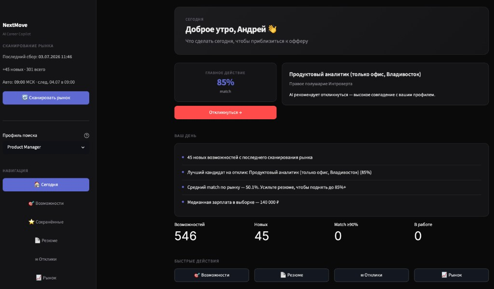
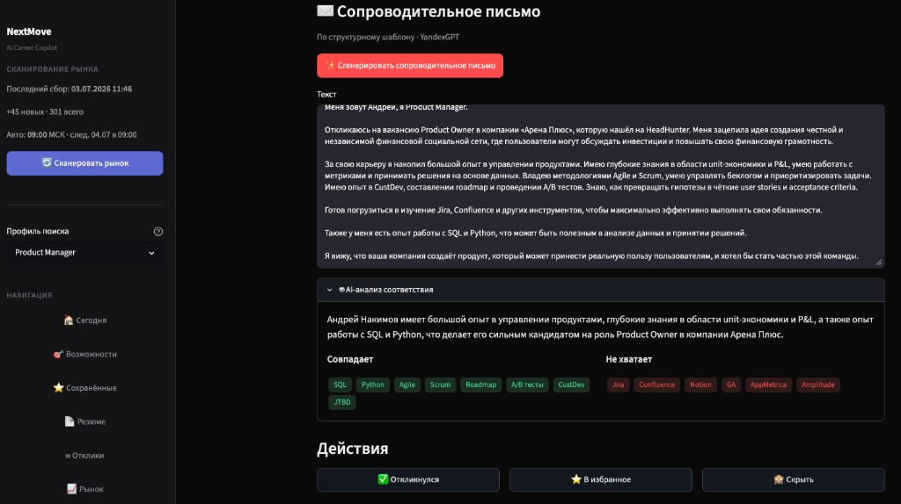
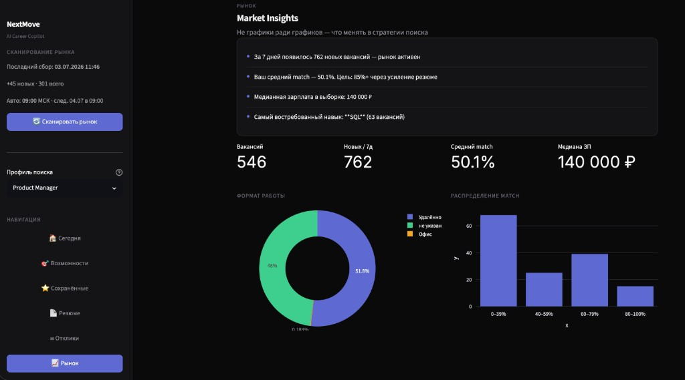
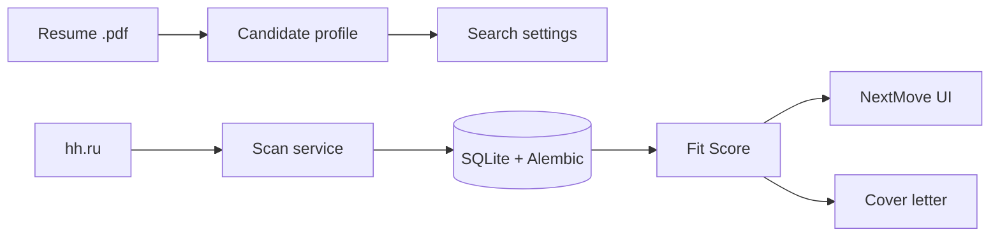

[Русский 🇷🇺](README_ru.md) / **English 🇺🇸**

# NextMove

**AI Career Copilot** — built to help you **get hired**, not just browse vacancies.

[](https://www.python.org/downloads/)
[](https://streamlit.io/)
[](LICENSE)

> Personal job-search assistant for **any role**. Upload your resume (`.pdf`) — AI builds a candidate profile, generates search keywords for **hh.ru**, and ranks vacancies against **your** background. GitHub repo: [`job-scout`](https://github.com/addito-5G/job-scout). UI brand: **NextMove**. Not SaaS, not mass auto-apply — analysis, prioritization, and application materials with you in the loop.

**Core question:** *what should I do today to maximize my chances of getting an offer?*

---

## Screenshots

### Today — daily briefing



### Vacancy — AI Match & cover letter



### Market — Market Insights



---

## Why it exists

| Pain | How NextMove helps |
|------|---------------------|
| Hundreds of jobs — where to focus | **Fit Score %** — deterministic match + gaps to improve |
| Role switch (analyst → designer → PM) | Profile filter without wiping the DB |
| Applying takes time | Cover letter draft + AI fit advice per vacancy |
| No sense of progress | Application funnel + daily briefing |

---

## Features

| Section | Purpose |
|---------|---------|
| **Today** | Daily briefing: top action, insights, metrics |
| **Opportunities** | Companies → vacancies, fit score, quick actions |
| **Saved / Applications** | Job search CRM funnel |
| **Resume** | AI Resume Coach — what to strengthen for the market |
| **Market** | Market Insights — demand, salary, skills |
| **Career Agent** | Search preferences (role, keywords, salary) |

Pipeline: **scan (hh.ru) → enrich → fit score → cover letter**. Optional daily run at 09:00 via macOS launchd.

---

## How it works

**Any resume → your search strategy → your matches.** No hardcoded role: developer, designer, analyst, PM — the pipeline adapts to what AI extracts from your CV.

1. Upload resume `.pdf` (or paste text) → `parse_resume` builds profile (skills, roles, salary range)
2. AI suggests search settings (`suggest_filters`) — job titles, keywords, regions
3. Scan pulls vacancies from **hh.ru**
4. **Fit Score** (`domain/fit_score.py`) ranks each vacancy vs your profile — weighted must/nice skills, role, experience, domain, evidence
5. Cover letter + AI fit advice — AI drafts, you send manually



### AI: free by design

NextMove is built to run **at zero API cost** for everyday use:

| Provider | Cost | Daily limits (default) | Used for |
|----------|------|------------------------|----------|
| **Ollama** (local) | Free, unlimited | None | Resume parsing, search keywords |
| **YandexGPT** | Free tier | 50 000 tokens/day | Cover letters, outreach, resume coach |
| **Groq** | Free tier | 14 000 requests/day | Resume improvements (optional) |

**Local model (Ollama):** `qwen2.5:14b` by default (`OLLAMA_MODEL` in `.env`). Install [Ollama](https://ollama.com), then:

```bash
ollama pull qwen2.5:14b
```

**Automatic fallback:** the AI Router tracks daily usage. When a cloud provider hits its free limit, the task switches to the next provider in the chain. If all cloud limits are exhausted, it falls back to **local Ollama**. Responses are cached in SQLite (`ai_cache`) to save tokens.

| Task | Primary | Fallback chain |
|------|---------|----------------|
| `parse_resume`, `suggest_filters` | **Ollama** | Yandex → Groq |
| `generate_cover_letter`, `improve_resume` | **YandexGPT** | Groq → **Ollama** |

**Fit Score** is computed locally (no LLM) — consistent %, matched/missing skills, and “what to strengthen”.

For fully offline / unlimited usage, keep Ollama running — it has no daily caps.

---

## Quick start

### 1. Clone & install

```bash
git clone https://github.com/addito-5G/job-scout.git
cd job-scout

python3 -m venv venv
source venv/bin/activate   # Windows: venv\Scripts\activate
pip install -e ".[dev]"
```

### 2. Configure

```bash
cp .env.example .env
```

Minimum for a useful run:

| Variable | Purpose |
|----------|---------|
| `OLLAMA_MODEL` | Local model, default **`qwen2.5:14b`** |
| `GROQ_API_KEY` | Optional — resume improvements fallback |
| `YC_FOLDER_ID`, `YC_KEY_PATH` | YandexGPT cover letters |
| `CONTACT_PHONE`, `CONTACT_TELEGRAM`, `CONTACT_LINKEDIN` | Signature in letters |
| `DATABASE_URL` | SQLite path (default `sqlite:///./data/vacancies.db`) |
| `RESUME_PATH` | Path to your resume `.pdf` / `.md` / `.txt` |

Full list: [`.env.example`](.env.example).

### 3. Initialize DB & run UI

```bash
python scripts/init_db.py
streamlit run app.py --server.port 8502
```

Open **http://localhost:8502** → upload resume → **Scan market** in the sidebar.

**macOS shortcut:** double-click `Запустить Job Scout.command`

### 4. First-time setup (CLI)

```bash
python scripts/setup.py      # profile + AI search settings
python scripts/scan.py       # fetch vacancies
python scripts/match.py --limit 50   # compute fit scores
```

### Optional: browser enrich & schedule

```bash
pip install -r requirements-browser.txt
bash scripts/install_schedule.sh
```

---

## Project structure

```
job-scout/                    # repo name (UI brand: NextMove)
├── app.py                    # Streamlit entry point
├── pyproject.toml            # package metadata & dev deps
├── alembic/                  # DB migrations
├── config/                   # criteria.yaml, sources.yaml, schedule
├── ui/                       # Streamlit pages & design system
├── scripts/                  # CLI tools
├── tests/                    # pytest suite
└── src/
    ├── config.py             # .env loader
    ├── config_loader.py      # YAML config
    ├── cli_logging.py        # shared CLI logging
    ├── domain/               # fit_score, role types
    ├── ai/                   # router, cache, prompts
    ├── db/
    │   ├── tables.py         # SQLAlchemy ORM (source of truth)
    │   ├── engine.py         # connection & init_db()
    │   ├── migrations.py     # Alembic upgrade / legacy stamp
    │   └── repositories/     # data access
    ├── services/             # business logic
    │   ├── scan_service.py
    │   ├── match_service.py
    │   ├── cover_letter_service.py
    │   └── vacancy_service/  # listing, detail, writes
    └── adapters/             # hh.ru parser
```

Install in editable mode (`pip install -e ".[dev]"`) so `scripts/` and `ui/` import `src/` without `sys.path` hacks.

---

## CLI reference

| Command | Description |
|---------|-------------|
| `python scripts/init_db.py` | Create / migrate SQLite schema |
| `python scripts/setup.py` | Full onboarding: profile + search settings |
| `python scripts/scan.py` | Scan configured sources |
| `python scripts/match.py --limit 50` | Compute fit scores for vacancies |
| `python scripts/enrich.py` | Enrich vacancy descriptions |
| `python scripts/review.py list` | Review queue in terminal |
| `python scripts/daily_update.py` | Scheduled pipeline (scan + match + metrics) |

---

## Development

```bash
pip install -e ".[dev]"
pytest tests/ -q
```

### Database migrations (Alembic)

Schema is defined in `src/db/tables.py`. `init_db()` runs `alembic upgrade head` automatically.

```bash
alembic upgrade head    # apply migrations
alembic current         # show revision
alembic history
```

Legacy databases created before Alembic are stamped to `head` after lightweight column fixes.

---

## Human-in-the-loop

NextMove **does not** send applications for you. It prepares prioritization, match analysis, and cover letter drafts — you review and submit on each platform.

Respect platform Terms of Service. Do not use for aggressive scraping.

---

## Author

- GitHub: [@addito-5G](https://github.com/addito-5G)
- Telegram: [@addito](https://t.me/addito)
- Email: [addito1@yandex.ru](mailto:addito1@yandex.ru)

Questions and ideas → [Issues](https://github.com/addito-5G/job-scout/issues)

---

## License

[MIT](LICENSE)
