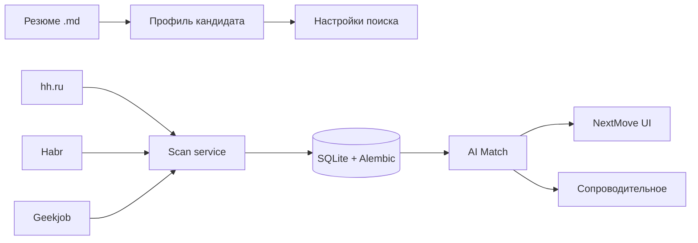

**Русский 🇷🇺** / [English 🇺🇸](README.md)

# NextMove

**AI Career Copilot** — помогает не искать вакансии, а **получить оффер**.

[](https://www.python.org/downloads/)
[](https://streamlit.io/)
[](LICENSE)

> Личный ассистент поиска работы **для любой роли**. Загружаете резюме (`.md`) — AI строит профиль, генерирует ключи для парсинга hh.ru / Habr / Geekjob и ранжирует вакансии под **ваш** опыт. Репозиторий: [`job-scout`](https://github.com/addito-5G/job-scout). UI-бренд: **NextMove**. Не SaaS и не массовый автоотклик — анализ, приоритизация и материалы для отклика с вашим контролем.

**Главный вопрос:** *что сделать сегодня, чтобы повысить шанс на оффер?*

---

## Скриншоты

### Сегодня — ежедневный брифинг


### Вакансия — AI Match и сопроводительное


### Рынок — Market Insights


---

## Зачем это нужно

| Боль | Как помогает NextMove |
|------|------------------------|
| Три площадки — три вкладки | Автоскан **hh.ru**, **Habr Career**, **Geekjob** |
| Сотни вакансий — неясно, куда бить | AI Match % + навыки «есть / нет» |
| Смена роли (аналитик → дизайнер → PM) | Фильтр профиля без очистки БД |
| Отклик отнимает время | Черновик сопроводительного под вакансию |
| Нет ощущения прогресса | Воронка откликов и daily briefing |

---

## Что умеет

| Раздел | Назначение |
|--------|------------|
| **Сегодня** | Daily briefing: главное действие, инсайты, метрики |
| **Возможности** | Приоритизированный список с match и быстрыми действиями |
| **Сохранённые / Отклики** | Воронка job search CRM |
| **Резюме** | AI Resume Coach — что усилить по рынку |
| **Рынок** | Market Insights — спрос, ЗП, навыки |
| **Career Agent** | Настройки поиска (роль, ключи, зарплата) |

Пайплайн: **scan → enrich → fast/deep match → cover letter**. Опционально — ежедневный запуск в 09:00 через macOS launchd.

---

## Как это работает

**Любое резюме → ваша стратегия поиска → ваши матчи.** Роль не зашита: разработчик, дизайнер, аналитик, PM — пайплайн подстраивается под то, что AI извлёк из CV.

1. Загрузка резюме `.md` → `parse_resume` строит профиль (навыки, роли, вилка ЗП)
2. AI предлагает настройки поиска (`suggest_filters`) — должности, ключи, регионы
3. Скан подтягивает вакансии с площадок по **вашим** запросам
4. Match оценивает каждую вакансию относительно **вашего** профиля
5. Черновик сопроводительного — под конкретную вакансию



### AI: бесплатно по умолчанию

NextMove рассчитан на **нулевую стоимость API** в повседневном использовании:

| Провайдер | Стоимость | Дневные лимиты (по умолчанию) | Задачи |
|-----------|-----------|-------------------------------|--------|
| **Ollama** (локально) | Бесплатно, без лимита | Нет | Парсинг резюме, fast match, ключи поиска |
| **YandexGPT** | Бесплатный tier | 50 000 токенов/день | Письма, RU-анализ |
| **Groq** | Бесплатный tier | 14 000 запросов/день | Глубокий match |

**Локальная модель (Ollama):** по умолчанию `qwen2.5:14b` (`OLLAMA_MODEL` в `.env`). Установите [Ollama](https://ollama.com), затем:

```bash
ollama pull qwen2.5:14b
```

**Автоматический fallback:** AI Router считает дневной расход. Когда у облачного провайдера заканчивается бесплатный лимит, задача переключается на следующий в цепочке. Если лимиты исчерпаны везде — используется **локальная Ollama**. Ответы кешируются в SQLite (`ai_cache`), чтобы экономить токены.

| Задача | Primary | Цепочка fallback |
|--------|---------|------------------|
| `parse_resume`, `fast_match`, `suggest_filters` | **Ollama** | Yandex → Groq |
| `generate_cover_letter` | **YandexGPT** | Groq → **Ollama** |
| `match_vacancy_deep`, `improve_resume` | **Groq** | Yandex → **Ollama** |

Для полностью офлайн / безлимитной работы держите Ollama запущенной — у неё нет дневных квот.

---

## Быстрый старт

### 1. Клонирование и установка

```bash
git clone https://github.com/addito-5G/job-scout.git
cd job-scout

python3 -m venv venv
source venv/bin/activate
pip install -e ".[dev]"
```

### 2. Настройка

```bash
cp .env.example .env
```

Минимум для работы:

| Переменная | Назначение |
|------------|------------|
| `OLLAMA_MODEL` | Локальная модель, по умолчанию **`qwen2.5:14b`** |
| `GROQ_API_KEY` | Глубокий анализ вакансий |
| `YC_FOLDER_ID`, `YC_KEY_PATH` | YandexGPT для писем |
| `CONTACT_PHONE`, `CONTACT_TELEGRAM`, `CONTACT_LINKEDIN` | Подпись в письмах |
| `DATABASE_URL` | Путь к SQLite (по умолчанию `sqlite:///./data/vacancies.db`) |
| `RESUME_PATH` | Путь к резюме `.md` |

Полный список: [`.env.example`](.env.example).

### 3. БД и UI

```bash
python scripts/init_db.py
streamlit run app.py --server.port 8502
```

Откройте **http://localhost:8502** → загрузите резюме → **«Сканировать рынок»** в сайдбаре.

**macOS:** двойной клик по `Запустить Job Scout.command`

### 4. Первичная настройка (CLI)

```bash
python scripts/setup.py      # профиль + настройки поиска (AI)
python scripts/scan.py       # сбор вакансий
python scripts/match.py --limit 50
```

### Опционально: enrich и расписание

```bash
pip install -r requirements-browser.txt
bash scripts/install_schedule.sh
```

---

## Структура проекта

```
job-scout/                    # имя репозитория (UI-бренд: NextMove)
├── app.py                    # точка входа Streamlit
├── pyproject.toml            # метаданные пакета и dev-зависимости
├── alembic/                  # миграции БД
├── config/                   # criteria.yaml, sources.yaml, schedule
├── ui/                       # страницы Streamlit и design system
├── scripts/                  # CLI-утилиты
├── tests/                    # pytest
└── src/
    ├── config.py             # загрузка .env
    ├── config_loader.py      # YAML-конфиги
    ├── cli_logging.py        # общее логирование CLI
    ├── domain/               # доменные типы (роль и т.д.)
    ├── ai/                   # router, cache, prompts
    ├── db/
    │   ├── tables.py         # SQLAlchemy ORM (источник истины)
    │   ├── engine.py         # подключение и init_db()
    │   ├── migrations.py     # Alembic upgrade / legacy stamp
    │   └── repositories/     # доступ к данным
    ├── services/             # бизнес-логика
    │   ├── scan_service.py
    │   ├── match_service.py
    │   ├── cover_letter_service.py
    │   └── vacancy_service/  # списки, детали, запись
    └── adapters/             # парсеры hh, habr, geekjob
```

Пакет ставится в editable mode — `scripts/` и `ui/` импортируют `src/` без `sys.path`.

---

## CLI

| Команда | Описание |
|---------|----------|
| `python scripts/init_db.py` | Создать / обновить схему SQLite |
| `python scripts/setup.py` | Полная настройка: профиль + поиск |
| `python scripts/scan.py` | Сканирование источников |
| `python scripts/match.py --limit 50` | AI-матчинг |
| `python scripts/enrich.py` | Обогащение описаний |
| `python scripts/review.py list` | Очередь в терминале |
| `python scripts/daily_update.py` | Пайплайн по расписанию |

---

## Разработка

```bash
pip install -e ".[dev]"
pytest tests/ -q
```

### Миграции БД (Alembic)

Схема в `src/db/tables.py`. `init_db()` применяет `alembic upgrade head` автоматически.

```bash
alembic upgrade head
alembic current
alembic history
```

Для БД, созданных до Alembic, выполняется `stamp head` после лёгких правок колонок.

---

## Human-in-the-loop

NextMove **не отправляет** отклики за вас. Он готовит приоритизацию, анализ match и черновики писем — вы проверяете и отправляете на площадке сами.

Соблюдайте правила площадок. Не используйте для агрессивного скрейпинга.

---

## Автор

- GitHub: [@addito-5G](https://github.com/addito-5G)
- Telegram: [@addito](https://t.me/addito)
- Email: [addito1@yandex.ru](mailto:addito1@yandex.ru)

Вопросы и идеи → [Issues](https://github.com/addito-5G/job-scout/issues)

---

## Лицензия

[MIT](LICENSE)
