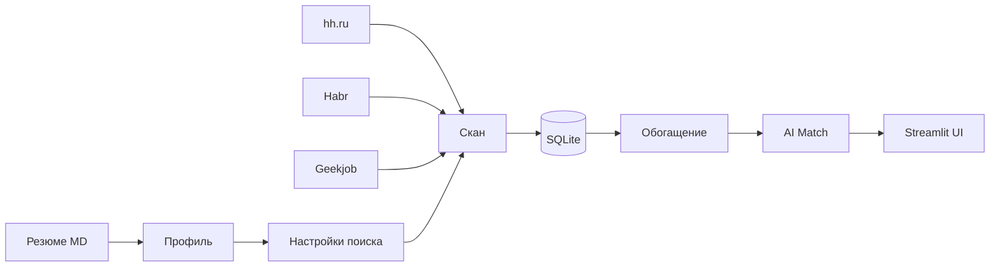

**Русский 🇷🇺** / [English 🇺🇸](README.md)

# Job Scout

**Личный ассистент по поиску работы** — pet-project для сбора вакансий, AI-матчинга с резюме и аналитики рынка.

[](https://www.python.org/downloads/)
[](https://streamlit.io/)
[](LICENSE)

> Сделано для собственного поиска работы (Product Manager). Это не SaaS и не автоотклик — только анализ, рекомендации и черновики сопроводительных.


---

## Привет!

Этот репозиторий — мой личный инструмент в поиске работы: собрал для себя, выложил сюда, чтобы делиться с друзьями и коллегами.

Если вы тоже устали вручную мониторить hh.ru, Habr и Geekjob — заглядывайте, форкайте, пишите в [Issues](https://github.com/addito-5G/job-scout/issues) или в [Telegram](https://t.me/addito). Буду рад обратной связи и новым знакомствам.

---

## Зачем это нужно

При активном поиске работы я устал от одного и того же ручного цикла:

- **Три площадки — три вкладки.** hh.ru, Habr Career, Geekjob. Каждое утро одно и то же: зайти, пробежать фильтры, выписать новое, не забыть то, что уже смотрел вчера.
- **Смена роли — другой рынок.** Переход с продуктового аналитика на продакта — это не просто другое резюме. Другие ключевые слова, другие навыки в требованиях, другой срез по seniority. Старые сохранённые вакансии аналитика мешали видеть картину по PM.
- **Сложно понять, «куда бить».** Резюме есть, вакансий сотни — но что рынок реально требует прямо сейчас? SQL и ClickHouse или unit economics и growth? Без агрегации это угадывание.
- **Отклик отнимает время.** На каждую интересную вакансию — снова читать описание, сверять с опытом, набрасывать сопроводительное. На десятки позиций в неделю это выматывает.

Job Scout закрывает эту боль: **один раз настроил профиль — дальше система сама собирает, фильтрует, оценивает и показывает, что требует рынок**. Я остаюсь на этапе принятия решения: откликаться или нет.

---

## Что умеет

| Модуль | Зачем |
|--------|-------|
| **Scan** | Парсинг hh.ru, Habr Career и Geekjob по AI-настройкам из резюме |
| **Enrich** | Полное описание, навыки и зарплата со страницы вакансии (браузер, опционально) |
| **Match** | Быстрый матч (Ollama) и глубокий (Groq/Yandex) — насколько вакансия бьётся с профилем |
| **Фильтр по роли** | Вакансии аналитика и продакта в одной базе — переключатель в сайдбаре, без очистки БД |
| **Дашборд** | Метрики, топ навыков, формат работы, динамика появления вакансий |
| **Рекомендации к резюме** | Сравнение резюме с требованиями рынка; что усилить, чего не хватает |
| **Cover letter** | Черновик сопроводительного под конкретную вакансию |
| **Расписание** | Ежедневный авто-сбор в 09:00 (macOS launchd) — утром уже свежие данные |

Автоотклик **намеренно не делается**: инструмент помогает сузить воронку и подготовить материалы, а не стрелять откликами вслепую.

---

## Как это работает



### AI Router

Задачи распределяются по провайдерам с fallback-цепочкой и кэшем в БД:

| Задача | Primary | Fallback |
|--------|---------|----------|
| `parse_resume`, `fast_match` | **Ollama** (локально) | Yandex → Groq |
| `suggest_filters`, `cover_letter` | **YandexGPT** | Groq → Ollama |
| `match_vacancy_deep`, `improve_resume` | **Groq** | Yandex → Ollama |

---

## Быстрый старт

```bash
git clone https://github.com/addito-5G/job-scout.git
cd job-scout

python3 -m venv venv
source venv/bin/activate
pip install -r requirements.txt

cp .env.example .env
# Заполните GROQ_API_KEY, YC_FOLDER_ID; положите yandex_key.json для YandexGPT

cp browser_config.example.json browser_config.json  # опционально, для enrich

python scripts/init_db.py
streamlit run app.py
```

Откройте **http://localhost:8501** → загрузите резюме (`.md`) → настройте поиск → **«Обновить сейчас»** в сайдбаре.

### Опционально: обогащение и расписание

```bash
pip install -r requirements-browser.txt
python -m camoufox fetch
bash scripts/install_schedule.sh   # ежедневно в 09:00, macOS
```

---

## Переменные окружения

| Переменная | Назначение |
|------------|------------|
| `OLLAMA_MODEL` | Локальная модель (`qwen2.5:14b`) |
| `GROQ_API_KEY` | Глубокий матч и рекомендации к резюме |
| `YC_FOLDER_ID`, `YC_KEY_PATH` | YandexGPT |
| `RESUME_PATH` | Путь к резюме по умолчанию |
| `DATABASE_URL` | `sqlite:///./data/vacancies.db` |

Полный список — в [`.env.example`](.env.example).

---

## Структура проекта

```
job-scout/
├── app.py                 # точка входа Streamlit
├── ui/                    # страницы и компоненты
├── config/
│   ├── criteria.yaml      # правила скоринга (настройте под себя)
│   ├── schedule.yaml      # расписание автообновления
│   └── sources.yaml       # парсеры и браузер
├── scripts/               # CLI: scan, enrich, match, daily_update
├── src/
│   ├── adapters/          # hh, habr, geekjob
│   ├── ai/                # router, providers, prompts, cache
│   ├── db/                # SQLAlchemy models
│   └── services/          # profile, scan, match, dashboard
└── data/                  # локальная БД и логи (не в git)
```

---

## CLI

```bash
python scripts/setup.py              # резюме → профиль + настройки поиска
python scripts/scan.py                 # сбор вакансий
python scripts/enrich.py --limit 20    # обогащение через браузер
python scripts/match.py --limit 30     # AI fast match
python scripts/daily_update.py         # полный пайплайн по расписанию
```

---

## macOS: запуск двойным кликом

| Файл | Действие |
|------|----------|
| **`Запустить Job Scout.command`** | Запуск Streamlit UI |
| **`Обновить вакансии (CLI).command`** | `scan.py` + `match.py` из терминала |

При первом запуске macOS может попросить: **ПКМ → Открыть**.

---

## Дисклеймер

Pet-project для личного поиска работы и экспериментов с AI. Соблюдайте правила площадок (hh.ru, Habr Career, Geekjob); не используйте для агрессивного или коммерческого скрейпинга.

---

## Автор

- GitHub: [@addito-5G](https://github.com/addito-5G) — профиль с другими pet-проектами
- Telegram: [@addito](https://t.me/addito) — пишите, если пригодилось или хотите обсудить
- Email: [addito1@yandex.ru](mailto:addito1@yandex.ru)

Если проект оказался полезен — звёздочка на GitHub или ссылка другу будут приятным сигналом. Спасибо, что заглянули.

---

## Лицензия

[MIT](LICENSE)