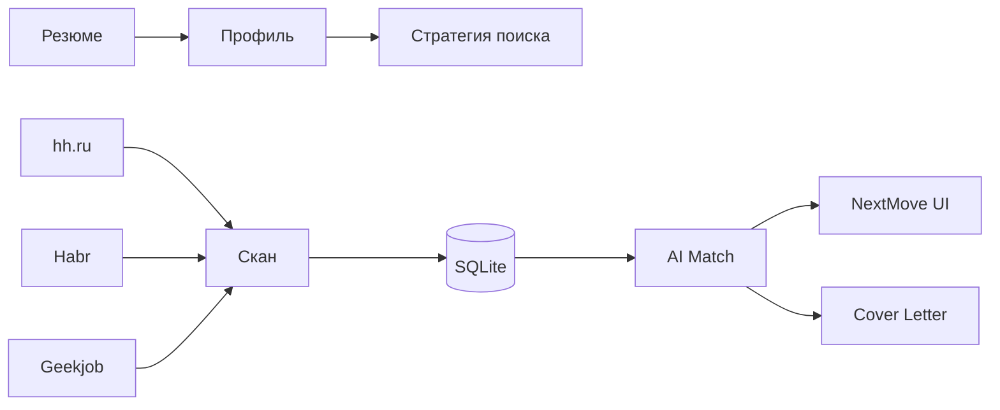

**Русский 🇷🇺** / [English 🇺🇸](README.md)

# NextMove

**AI Career Copilot** — помогает не искать вакансии, а **получить оффер**.

[](https://www.python.org/downloads/)
[](https://streamlit.io/)
[](LICENSE)

> Pet-project для личного поиска работы (Product Manager). Репозиторий: `job-scout`. UI-бренд: **NextMove**. Не SaaS и не автоотклик — анализ, приоритизация, материалы для отклика.

---

## Привет!

Я собрал этот инструмент для себя и выложил сюда, чтобы делиться с друзьями и коллегами. Если устали вручную мониторить hh.ru, Habr и Geekjob — форкайте, пишите в [Issues](https://github.com/addito-5G/job-scout/issues) или [Telegram](https://t.me/addito).

**Главный вопрос продукта:** *что сделать сегодня, чтобы повысить шанс на оффер?*

---

## Скриншоты

### Сегодня — ежедневный брифинг

Утром открываете приложение и сразу видите: новые возможности, лучший match, главное действие дня и быстрые ссылки.


### Вакансия — AI Match и сопроводительное

На карточке вакансии: анализ соответствия (совпадает / не хватает), рекомендация AI и генерация письма по структурному шаблону.


### Рынок — Market Insights

Не графики ради графиков: инсайты о спросе, зарплатах, match и навыках — чтобы менять стратегию поиска.


---

## Зачем это нужно

| Боль | Как помогает NextMove |
|------|------------------------|
| Три площадки — три вкладки | Автоскан hh.ru, Habr Career, Geekjob |
| Сотни вакансий — неясно, куда бить | AI Match % + навыки «есть / нет» |
| Смена роли (аналитик → PM) | Фильтр профиля без очистки БД |
| Отклик отнимает время | Черновик сопроводительного под вакансию |
| Нет ощущения прогресса | Воронка откликов и daily briefing |

---

## Что умеет

| Раздел | Назначение |
|--------|------------|
| **Сегодня** | Daily briefing: главное действие, инсайты, метрики |
| **Возможности** | Приоритизированный список с match, фильтры, быстрые действия |
| **Сохранённые / Отклики** | Воронка job search CRM |
| **Резюме** | AI Resume Coach — что усилить по рынку |
| **Рынок** | Market Insights — спрос, ЗП, навыки |
| **Career Agent** | Настройки поиска (роль, ключи, зарплата) |

Под капотом: scan → enrich → fast/deep match → cover letter. Расписание: ежедневно в 09:00 (macOS launchd).

---

## Как это работает



### AI Router

| Задача | Primary | Fallback |
|--------|---------|----------|
| `parse_resume`, `fast_match` | **Ollama** | Yandex → Groq |
| `cover_letter`, `suggest_filters` | **YandexGPT** | Groq → Ollama |
| `match_vacancy_deep`, `improve_resume` | **Groq** | Yandex → Ollama |

---

## Быстрый старт

```bash
git clone https://github.com/addito-5G/job-scout.git
cd job-scout

python3 -m venv venv
source venv/bin/activate
pip install -r requirements.txt

cp .env.example .env
# GROQ_API_KEY, YC_FOLDER_ID, yandex_key.json, CONTACT_* для писем

python scripts/init_db.py
streamlit run app.py --server.port 8502
```

Откройте **http://localhost:8502** → загрузите резюме (`.md`) → **«Сканировать рынок»** в сайдбаре.

Или двойной клик: **`Запустить Job Scout.command`**

### Расписание и enrich (опционально)

```bash
pip install -r requirements-browser.txt
bash scripts/install_schedule.sh
```

---

## Переменные окружения

| Переменная | Назначение |
|------------|------------|
| `OLLAMA_MODEL` | Локальная модель |
| `GROQ_API_KEY` | Глубокий match |
| `YC_FOLDER_ID`, `YC_KEY_PATH` | YandexGPT |
| `CONTACT_PHONE`, `CONTACT_TELEGRAM`, `CONTACT_LINKEDIN` | Подпись в письмах |
| `DATABASE_URL` | SQLite |

Полный список: [`.env.example`](.env.example).

---

## Структура

```
job-scout/          # репозиторий (legacy name)
├── app.py          # NextMove UI
├── ui/             # today, opportunities, applications, insights…
├── src/services/   # scan, match, today_service, cover_letter…
├── config/         # criteria, schedule, sources
└── scripts/        # CLI и launchd
```

---

## CLI

```bash
python scripts/setup.py
python scripts/scan.py
python scripts/match.py --limit 50
python scripts/daily_update.py --skip-scan   # без парсинга
```

---

## Дисклеймер

Pet-project для личного поиска работы. Соблюдайте правила площадок; не используйте для агрессивного скрейпинга.

---

## Автор

- GitHub: [@addito-5G](https://github.com/addito-5G)
- Telegram: [@addito](https://t.me/addito)
- Email: [addito1@yandex.ru](mailto:addito1@yandex.ru)

---

## Лицензия

[MIT](LICENSE)
